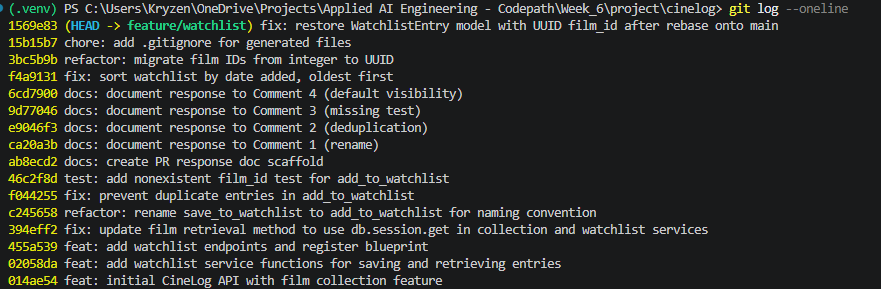

# PR Response Doc — CineLog Watchlist Feature

## AI Usage
I used Claude Code (an AI coding assistant) throughout this project, in a few distinct ways:

- **Codebase orientation before touching anything.** Before addressing any review comment, I had it read `models.py`, `services/collection_service.py`, and `tests/test_collection.py` and summarize the naming conventions, the deduplication pattern, and the test fixture structure — so that the watchlist fixes would match the existing codebase rather than introduce a new style.
- **Pattern-matching for Comment 2 (deduplication).** Rather than inventing a dedup mechanism from scratch, I asked it to compare `add_to_collection()` against the watchlist code and mirror the exact same pre-check-then-raise pattern (custom exception + `.filter_by(...).first()` check before insert), instead of e.g. relying only on a DB-level constraint.
- **Root-cause diagnosis for Comment 6 (rebase).** `git rebase origin/main` reported zero conflicts, which could easily have been read as "nothing to check." I had it diff the individual upstream commits instead, which surfaced that main's UUID-migration commit had silently deleted the `WatchlistEntry` class entirely (since main never had the watchlist feature) — a logical break with no textual conflict to flag it. That diagnosis is what `models.py`'s fix was based on.
- **Commit hygiene audit.** I asked it to evaluate the full commit history against `CONTRIBUTING.md`'s format and "one logical change per commit" rules. It correctly identified `ec90edb` ("added watchlist model and endpoint fixed a bug more changes") as matching CONTRIBUTING.md's own listed "Not acceptable" examples, and — importantly — flagged its *own* earlier commit (`5b514b3`) as bundling four review-comment responses together. I had it split both via a scripted interactive rebase.
- **Stress-testing the Comment 5 argument.** When drafting the sort-order response, I asked it to engage directly with the reviewer thread rather than just pick a direction. That's how it caught something I hadn't noticed myself: the maintainer's stated reasoning ("most users want to see what they added recently") and Dani-risingBW's reasoning ("find the oldest one to finally watch") actually argue for *opposite* sort directions, even though the thread reads as agreement. That tension became the core of the final argument — I directed it to side with Dani's framing (oldest-first, since a watchlist is a backlog, not a feed) rather than the maintainer's literal wording, but the catch itself came from having it read both comments closely side by side rather than skimming for the general sentiment ("date-added, not alphabetical").
- **Comment 4 fact-checking.** For the default-visibility argument, I had it draft the position, but I pushed it to ground the "CineLog is a community/discovery app" premise in an actual source rather than an assumption — it pointed to the literal README wording ("a community film tracking app") rather than asserting that framing on its own. The tradeoff paragraph (watchlist reveals intent vs. a collection's completed, considered action) was accepted close to as drafted, since it accurately named the real risk rather than a generic privacy disclaimer.

## Comment 1 — Rename
**What I did:** Renamed `save_to_watchlist()` to `add_to_watchlist()` in `services/watchlist_service.py` to match the project's `verb_to_noun` convention (`add_to_collection()`, `remove_from_collection()`). Updated the one call site in `routes/watchlist/watchlist.py` (both the import and the function call).
**How I verified:** Ran a project-wide search (`grep -rn save_to_watchlist`) after the rename and confirmed zero remaining references to the old name.

## Comment 2 — Deduplication
**What I did:** Added an `AlreadyInWatchlistError` exception to `services/watchlist_service.py`, mirroring `AlreadyInCollectionError` in `collection_service.py`. `add_to_watchlist()` now queries for an existing `WatchlistEntry` with the same `user_id`/`film_id` before inserting, and raises `AlreadyInWatchlistError` if one is found — same pre-check-then-raise pattern as `add_to_collection()`.
**How I verified:** Read through `add_to_collection()` in `collection_service.py` to confirm the pattern (exception class + `.filter_by(...).first()` check before insert) and mirrored it exactly.

## Comment 3 — Missing test
**What I did:** Created `tests/test_watchlist.py`, mirroring `test_add_to_collection_nonexistent_film_raises` from `test_collection.py`. It reuses the same `app` and `sample_user` fixtures and adds `test_add_to_watchlist_nonexistent_film_raises`, which asserts that calling `add_to_watchlist()` with a film_id that doesn't exist raises `FilmNotFoundError`.
**How I verified:** Ran `pytest tests/test_watchlist.py -v` using the project's `.venv` interpreter — 1 passed.

## Comment 4 — Default visibility
**My position:** I'm keeping `public=True` as the default for `WatchlistEntry`.

**Reasoning:** CineLog is described in the README as "a community film tracking app" — the core value of the product is social: seeing what other users are watching, rating, and planning to watch. A watchlist that's private by default is invisible by default, which works against that goal. If most users never touch the visibility setting (which is the common case for any default), a private-by-default watchlist would mean the feature quietly fails to contribute to the discovery/community experience it's meant to support. I'm optimizing for the "browse what people are excited to watch" behavior — low-friction sharing where a user has to actively opt out of visibility rather than opt in. This also keeps `WatchlistEntry` consistent with the rest of the app's posture: nothing else in the collection feature is gated behind a privacy flag, so introducing a private-by-default watchlist would be an inconsistent, unannounced departure from how the rest of the user's activity is treated.

**Tradeoff acknowledged:** The real cost is that a watchlist is a more exposed signal than a collection. A `CollectionEntry` reflects a film someone already watched and (optionally) rated — a completed, considered action. A `WatchlistEntry` reflects intent: films someone hasn't seen yet, which can surface genre preferences, guilty pleasures, or viewing habits the user hasn't decided they're comfortable sharing yet. A user who doesn't realize the default is public could have that list visible before they've thought about who can see it — that's a real privacy cost, not a hypothetical one. If we had evidence that users are surprised by this (e.g., support tickets, or user research showing discomfort), I'd revisit the default rather than treat this decision as final. For now, given the product's social framing and no such signal yet, I'm choosing the default that serves the core discovery use case, with the tradeoff being the un-anticipated visibility risk for users who never check the setting.

## Comment 5 — Sort order
**My position:** Switched `get_watchlist()` from alphabetical (`Film.title.asc()`) to date-added order — but ascending (oldest added first), not descending.

**Reasoning:** A watchlist is a backlog, not a feed. Its purpose is to eventually get cleared, not to showcase what's freshest. Sorting oldest-first surfaces the films that have been sitting the longest, which is exactly the "what should I finally watch" prompt a watchlist should give. If newest-first were used instead, a user could keep adding films indefinitely while the same handful of old, forgotten entries sink to the bottom and never get watched — the opposite of what the feature is for. This is also why alphabetical was wrong in the first place: it optimizes for neither recency nor priority, just letter order.

**Engagement with reviewer's point:** The maintainer and Dani-risingBW's comments actually point in two different directions, even though they read as agreement. The maintainer's stated reason was "most users want to see what they added recently" — that's an argument for newest-first. Dani-risingBW's follow-up argued for being able to "go to the oldest movie in their watchlist that they added because they finally want to mark it off" — that's explicitly an argument for oldest-first. Both are "date-added order" in name, but they imply opposite sort directions.

I'm siding with Dani-risingBW's framing over the maintainer's original wording, because it matches the actual use case of a watchlist (a to-do list you want to clear) rather than treating it like an activity feed (where recency is the point, e.g. `get_collection()`'s newest-first order over already-watched films makes sense because that's a history, not a queue). If the maintainer still wants newest-first after seeing this distinction called out explicitly, that's a one-line change (`.desc()` instead of `.asc()`), but I don't think "recently added" was meant to argue against being able to clear old entries — I think it under-specified the direction before Dani's comment surfaced the tension.

**Note found during verification:** While testing this change end-to-end, I found `get_watchlist()` calls `entry.film.to_dict()`, but `WatchlistEntry` has no `.film` relationship defined in `models.py` (only `CollectionEntry` gets a `backref="film"` from `Film.collection_entries`). This means `get_watchlist()` currently raises `AttributeError` at runtime regardless of sort order — it's a pre-existing bug, not something introduced by this change. I verified the ORDER BY clause itself is correct by querying directly against `WatchlistEntry`/`Film` without going through `entry.film`, but the function as a whole is currently broken. Flagging this separately since it wasn't one of the six review comments — see conversation for how to proceed.

## Comment 6 — Rebase
**What conflicted:** Ran `git fetch origin` then `git rebase origin/main`. It completed with no textual merge conflicts, but that masked a logical one: main's UUID-migration commit (`refactor: migrate film IDs from integer to UUID`) changed `Film.id`/`CollectionEntry.film_id` to UUID strings *and* deleted the `WatchlistEntry` class from `models.py` entirely (main never had the watchlist feature, so from its perspective that class was unused). Since none of our watchlist commits ever touched `models.py`, git had nothing to conflict against — the rebase silently applied that deletion, leaving `WatchlistEntry` missing from `models.py` after rebasing, even though `services/watchlist_service.py` and `routes/watchlist/watchlist.py` still imported and depended on it.

**How I resolved it:** Re-added the `WatchlistEntry` class to `models.py`, using `db.String(36)` (UUID) for `film_id` instead of the old `db.Integer`, matching the migrated `Film.id` and `CollectionEntry.film_id` pattern. Updated the stale integer references: the `film_id` docstring in `add_to_watchlist()` (`services/watchlist_service.py`) now says `str: UUID of the film` instead of `int: ... (pre-refactor)`, and the route docstring in `routes/watchlist/watchlist.py` now shows `Body: { "film_id": "<uuid>" }` instead of `<int>`.

**How I verified no conflict remains:** Ran the full suite (`pytest tests/ -v`) — all 5 tests pass, including the Comment 3 nonexistent-film test. Also ran a manual end-to-end check creating a real `User`/`Film` with generated UUIDs and calling `add_to_watchlist()` twice: the first call succeeds and returns a UUID-keyed entry, the second correctly raises `AlreadyInWatchlistError` — confirming Comment 2's dedup logic still works against UUID ids post-rebase. Checked `git log --merges --oneline feature/watchlist`: the only merge commit in the ancestry is `bbe206c`, which is pre-existing on `main` itself (from an unrelated `.gitignore` PR) and not something this rebase introduced — `git rebase` (as opposed to `git merge origin/main`) guarantees we didn't add any merge commits of our own.

The final, cleaned-up linear history (after also splitting `ec90edb` and the doc commit into properly typed, single-purpose commits):



## PR Description

### What this does
Adds a watchlist feature to CineLog. Users can save films they intend to watch later — separate from their collection, which tracks films they've already watched and rated. This adds a `WatchlistEntry` model, service functions (`add_to_watchlist()`, `get_watchlist()`), and two endpoints: one to add a film to a user's watchlist, and one to view it.

### Design decisions
1. **Default visibility (`public=True`)** — Watchlists default to public. CineLog is a community/discovery-oriented app, and a private-by-default watchlist would be invisible by default for the (likely majority of) users who never touch the setting, undermining the social/discovery value the feature is meant to add. The tradeoff: a watchlist exposes *intent* (unwatched, undecided preferences), which is a more exposed signal than a completed, already-rated `CollectionEntry` — a user who never checks the setting could have that exposed before they've thought about who can see it. Full reasoning in Comment 4 above.
2. **Sort order (oldest-added first)** — `get_watchlist()` sorts by `date_added` ascending, not descending. A watchlist is a backlog meant to be cleared, not a feed meant to showcase what's freshest — oldest-first surfaces the films that have been sitting the longest, prompting "what should I finally watch," rather than letting old, forgotten entries sink out of view as new ones are added. Full reasoning, including engagement with the reviewer discussion, in Comment 5 above.

### Known issues (pre-existing, not introduced by this PR's six review-comment fixes)
- `GET /watchlist/<user_id>` currently raises `AttributeError`. `WatchlistEntry` has no relationship to `Film` defined in `models.py` (only `CollectionEntry` gets a `backref="film"` from `Film.collection_entries`), so `entry.film` in `get_watchlist()` fails. This bug predates all six review comments — it was present in the original `ec90edb` commit's implementation.
- Neither `FilmNotFoundError` nor `AlreadyInWatchlistError` is currently caught in `routes/watchlist/watchlist.py`, so `POST /watchlist/<user_id>/add` returns a raw 500 for the not-found and duplicate cases instead of a clean 404/409, unlike the analogous handling in `routes/collection.py`.

### How to test this manually
There's no endpoint to create users or films (films are seeded; see `routes/films.py`), so steps 2 uses a Python shell directly.

1. Start the app: `python app.py` (or, from this repo, `./.venv/Scripts/python.exe app.py` on Windows).
2. In a separate Python shell, create a test user and film directly, and note their generated UUIDs:
   ```python
   from app import create_app, db
   from models import User, Film

   app = create_app()
   with app.app_context():
       user = User(username="demo", email="demo@example.com")
       film = Film(title="Arrival", year=2016)
       db.session.add_all([user, film])
       db.session.commit()
       print("user_id:", user.id)
       print("film_id:", film.id)
   ```
3. Add the film to the watchlist and confirm the default-visibility decision:
   ```bash
   curl -X POST http://localhost:5000/watchlist/<user_id>/add \
     -H "Content-Type: application/json" \
     -d '{"film_id": "<film_id>"}'
   ```
   Expect `201` with a JSON body where `"public": true`.
4. Confirm deduplication (Comment 2) by repeating the exact same request. Expect a `500` right now (see "Known issues" above — the route doesn't catch `AlreadyInWatchlistError` yet). To confirm the duplicate is actually rejected (not silently double-inserted), check the service layer directly instead:
   ```python
   from services.watchlist_service import add_to_watchlist, AlreadyInWatchlistError
   with app.app_context():
       add_to_watchlist(user_id="<user_id>", film_id="<film_id>")  # should raise AlreadyInWatchlistError
   ```
5. Confirm sort order (Comment 5). Since `GET /watchlist/<user_id>` currently errors (see "Known issues"), verify the ordering directly against the database instead of through the endpoint:
   ```python
   from models import WatchlistEntry
   with app.app_context():
       entries = (
           WatchlistEntry.query
           .filter_by(user_id="<user_id>")
           .order_by(WatchlistEntry.date_added.asc())
           .all()
       )
       print([(e.film_id, e.date_added) for e in entries])
   ```
   Add a second film to the watchlist and re-run this query — the film added first should appear first in the results (oldest-added order), not alphabetically and not most-recent-first.
6. Run the automated test suite: `pytest tests/ -v` — expect `5 passed`, including `test_add_to_watchlist_nonexistent_film_raises` from Comment 3.
